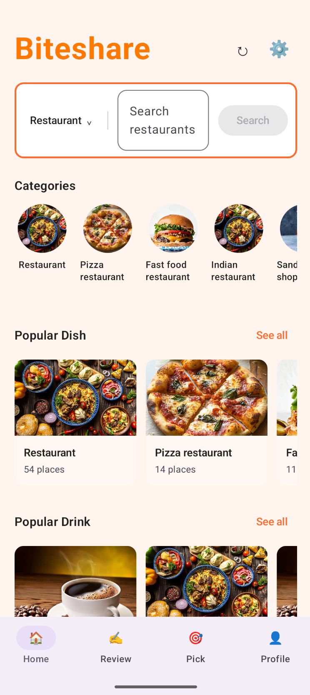
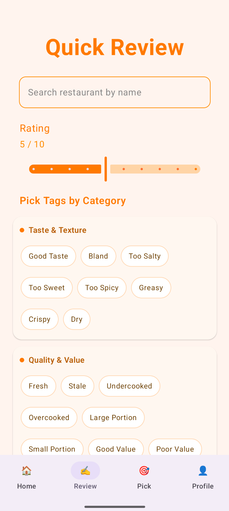
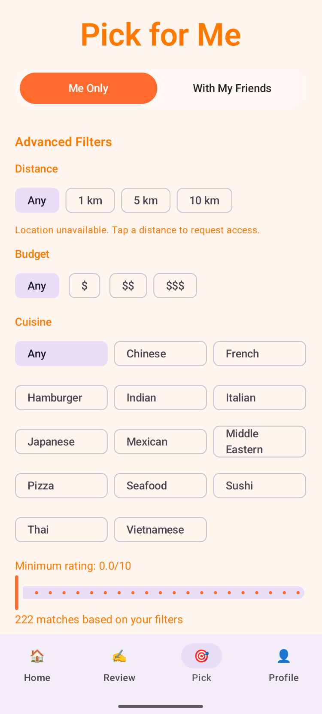
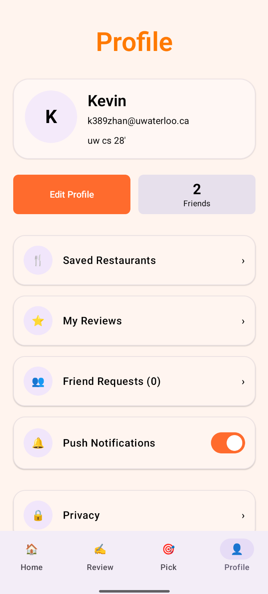

# BiteShare

BiteShare helps you discover restaurants, save favorites, and decide where to eat with friends.

## Contents
1. [Description](#description)
2. [Project Information](#project-information)
3. [User Guide](#user-guide)
4. [Design Documents](#design-documents)

## Description

### Product Name
BiteShare

### Product Summary
BiteShare is a restaurant discovery and decision app. Browse or search restaurants,
filter by distance, budget, cuisine, and rating, and save places you want to revisit. Post quick
tagged reviews and connect with friends to use Pick-for-Me and group voting when you need to
choose a spot together.

### Main Window Screenshot

 

 

### Video Walkthrough
[Walkthrough Video](https://www.youtube.com/shorts/On8riUHww5Q)

### Acknowledgements
Third-party libraries:

- JetBrains Compose Multiplatform
- Kotlin Multiplatform
- Kotlinx Coroutines
- Kotlinx Serialization
- Kotlinx DateTime
- AndroidX Activity Compose
- AndroidX Lifecycle
- Ktor (client and server)
- Supabase PostgREST
- Coil
- Logback

## User Guide

- [Getting Started](https://git.uwaterloo.ca/b3lam/cs346-group-7/-/wikis/Getting-Started)
- [Usage Guide](https://git.uwaterloo.ca/b3lam/cs346-group-7/-/wikis/Usage-Guide)

## Design Documents

- [ERD Diagram](https://git.uwaterloo.ca/b3lam/cs346-group-7/-/wikis/ERD-Diagram)
- [Class Diagrams](https://git.uwaterloo.ca/b3lam/cs346-group-7/-/wikis/Class-Diagrams)

